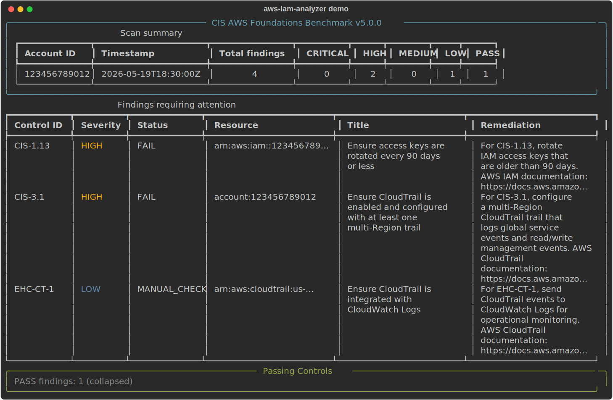

# aws-iam-analyzer

[](https://github.com/Rblea97/aws-iam-analyzer/actions/workflows/ci.yml)


`aws-iam-analyzer` is a read-only Python CLI that audits a single AWS account for IAM and CloudTrail posture against CIS AWS Foundations Benchmark v5.0.0, then produces severity-ranked terminal and JSON findings with remediation guidance.



The demo above is generated from synthetic data through the same Rich renderer used by the CLI. A matching sample report is available at [`docs/examples/sample-findings.json`](docs/examples/sample-findings.json), and the full walkthrough is in [`docs/demo.md`](docs/demo.md).

## What This Demonstrates

- AWS IAM and CloudTrail security posture analysis against named CIS control IDs.
- Least-privilege scanner design using boto3's standard credential provider chain.
- Clear separation between strict CIS findings and enterprise CloudTrail hardening checks.
- Typed findings with Pydantic v2, Rich terminal output, atomic JSON reports, and CI-friendly exit codes.
- Production hygiene for a security tool: non-root Docker runtime, structured logs, credential leak detection, SAST, dependency audit, container scanning, and branch-protected CI.

## Key Features

- Scans one AWS account with read-only credentials resolved by boto3.
- Evaluates 15 executable CIS IAM/CloudTrail controls and 3 enterprise CloudTrail hardening controls.
- Renders a severity-sorted Rich terminal report and writes a machine-readable JSON report.
- Writes JSON output atomically with `0o600` permissions because reports can reveal account structure.
- Returns a non-zero exit code when HIGH or CRITICAL findings exist and `--exit-code` is enabled.

## Quick Start

Reviewer path with no AWS account required:

```powershell
git clone https://github.com/Rblea97/aws-iam-analyzer.git
cd aws-iam-analyzer
docker build -t aws-iam-analyzer .
docker run --rm aws-iam-analyzer --help
docker run --rm aws-iam-analyzer scan --help
```

Run the published container image:

```powershell
docker pull ghcr.io/rblea97/aws-iam-analyzer:latest
docker run --rm ghcr.io/rblea97/aws-iam-analyzer:latest --help
```

Install and run locally against a lab AWS account:

```powershell
python -m pip install git+https://github.com/Rblea97/aws-iam-analyzer.git
iam-analyzer scan --profile audit-profile --region us-east-1 --output-file findings.json
```

Run with the default boto3 credential chain:

```powershell
iam-analyzer scan --region us-east-1
```

Run as a CI gate:

```powershell
iam-analyzer scan --profile audit-profile --severity-filter HIGH --exit-code
```

The CLI never accepts raw AWS credential values or credential files as arguments. Use environment variables, an AWS profile, AWS IAM Identity Center, an instance role, or a container role supported by boto3.

## Docker Usage

Use the published GHCR image:

```powershell
docker run --rm ghcr.io/rblea97/aws-iam-analyzer:latest --help
```

Build the image:

```powershell
docker build -t aws-iam-analyzer .
```

Run with an AWS profile mounted read-only:

```powershell
docker run --rm -e AWS_PROFILE=audit-profile -v "$env:USERPROFILE\.aws:/home/appuser/.aws:ro" aws-iam-analyzer scan
```

Use the same credential mount with the published image:

```powershell
docker run --rm `
  -e AWS_PROFILE=audit-profile `
  -v "$env:USERPROFILE\.aws:/home/appuser/.aws:ro" `
  ghcr.io/rblea97/aws-iam-analyzer:latest scan
```

Write a report from inside the container:

```powershell
docker run --rm `
  -e AWS_PROFILE=audit-profile `
  -v "$env:USERPROFILE\.aws:/home/appuser/.aws:ro" `
  aws-iam-analyzer scan --output-file /home/appuser/findings.json
```

For Windows Docker Desktop, writing directly to a bind-mounted host output directory can depend on host filesystem permissions. The portable path is to write inside `/home/appuser` and copy the report out with `docker cp`, or to use a host directory with explicit write permission for the container user.

Do not bake AWS credentials, `.env` files, or local AWS config into the image.

## Release And Demo

The CI workflow publishes GHCR images on every merge to `main` and on version tags. Main builds receive immutable commit SHA tags, `sha-<commit>` tags, and `latest`; release tags such as `v0.1.0` also publish `v0.1.0` and `0.1.0` tags.

See [`docs/release.md`](docs/release.md) for the V1 release checklist, demo validation steps, and release note template.

## Scanner IAM Policy

Attach the policy in [`docs/scanner-iam-policy.json`](docs/scanner-iam-policy.json) to the scanner role or principal used for demos. It grants only the read/list/get evidence APIs required by the currently implemented checks, `iam:GenerateCredentialReport` for IAM credential report generation, and `sts:GetCallerIdentity` for startup validation.

## Controls In Scope

The executable v1.0 scanner evaluates these strict CIS controls:

- `CIS-1.3`, `CIS-1.5`, `CIS-1.7`, `CIS-1.8`, `CIS-1.9`, `CIS-1.11`, `CIS-1.13`, `CIS-1.14`, `CIS-1.15`, `CIS-1.16`, `CIS-1.21`
- `CIS-3.1`, `CIS-3.2`, `CIS-3.4`, `CIS-3.5`

The scanner also evaluates these enterprise hardening controls:

- `EHC-CT-1`, `EHC-CT-2`, `EHC-CT-3`

See [`docs/controls.md`](docs/controls.md) for control titles, evidence APIs, severities, remediation summaries, and registered CIS controls that are not yet wired into scan execution.

## Example JSON Output

The public example report uses fictional resources and placeholder account data:

```powershell
Get-Content .\docs\examples\sample-findings.json
```

The real report shape is:

```json
{
  "scan_metadata": {
    "account_id": "123456789012",
    "scan_timestamp": "2026-05-19T18:30:00Z",
    "benchmark": "CIS AWS Foundations Benchmark v5.0.0",
    "controls_evaluated": ["CIS-1.13", "CIS-3.1", "CIS-3.2", "EHC-CT-1"],
    "duration_ms": 948
  },
  "summary": {
    "CRITICAL": 0,
    "HIGH": 2,
    "MEDIUM": 0,
    "LOW": 1,
    "PASS": 1
  },
  "findings": [
    {
      "control_id": "CIS-1.13",
      "control_title": "Ensure access keys are rotated every 90 days or less",
      "severity": "HIGH",
      "status": "FAIL",
      "resource_id": "arn:aws:iam::123456789012:user/demo-auditor",
      "remediation": "For CIS-1.13, rotate IAM access keys that are older than 90 days. AWS IAM documentation: https://docs.aws.amazon.com/IAM/latest/UserGuide/id_credentials_access-keys.html",
      "raw_evidence": {
        "source": "fictional-demo-data",
        "user": "demo-auditor",
        "credential_age_days": 127
      },
      "evaluated_at": "2026-05-19T20:46:46.674992Z"
    }
  ]
}
```

## Challenges And Solutions

| Challenge | Solution |
| --- | --- |
| CIS coverage must be honest and auditable. | The code separates registered control metadata from executable `CHECK_SPECS`, and the docs distinguish implemented controls from roadmap controls. |
| A scanner needs AWS access but must not become a credential sink. | Credentials flow only through `boto3.Session`; the CLI validates profile names and never accepts raw key material. |
| Findings need to work for humans and automation. | Rich renders a severity-sorted terminal report while Pydantic models serialize the same findings into JSON for CI artifacts. |
| AWS APIs are paginated and permission-dependent. | Checks receive pre-built clients, use shared pagination helpers, and return `MANUAL_CHECK` findings instead of crashing on permission gaps. |
| Security tooling should prove its own hygiene. | CI runs Ruff, mypy, pytest coverage, Bandit, pip-audit, Semgrep, Docker build, Trivy, Hadolint, and Gitleaks before merge. |

## Security Model

| Threat | Mitigation |
| --- | --- |
| Credential disclosure | Credentials are never accepted as CLI arguments, stored by the tool, or logged. boto3 resolves credentials through its standard chain. |
| Sensitive findings exposure | JSON reports are written atomically and chmodded to `0o600` because they may contain account structure data. |
| Dependency supply chain risk | CI uses a hash-pinned lockfile and runs `pip-audit`, Semgrep, Bandit, Trivy, Hadolint, and Gitleaks. |
| AWS resource name injection | Resource identifiers are treated as untrusted data and escaped in Rich output. Logs use structlog key-value fields. |
| Container compromise blast radius | The runtime image uses a non-root user and excludes local docs, tests, AWS credentials, and build tooling. |

## Architecture

The project uses a small layered CLI architecture: `cli` handles Typer options, `scanner` owns boto3 sessions and orchestration, `checks` contains one check function per control, `models` validates findings and scan results, and `reporter` renders terminal and JSON output. This keeps checks independently testable and leaves room for future multi-account scanning without changing the check contract.

See [`ARCHITECTURE.md`](ARCHITECTURE.md) for the architecture summary and credential model.

## Contributing A New Check

1. Add or confirm the control metadata in `src/iam_analyzer/checks/registry.py`.
2. Write focused tests for compliant, failing, and edge or permission-denied states.
3. Implement one check function in the relevant `checks` module. The function must accept pre-initialized clients and return `Finding` objects.
4. Add the check to `src/iam_analyzer/checks/catalog.py` so the scanner orchestrator executes it.
5. Update `docs/controls.md` and the scanner IAM policy if the check needs additional read-only evidence APIs.
6. Run the full quality and security gate before opening a PR.

For more detail, see [`CONTRIBUTING.md`](CONTRIBUTING.md).

## License

Apache-2.0. See [`LICENSE`](LICENSE).
